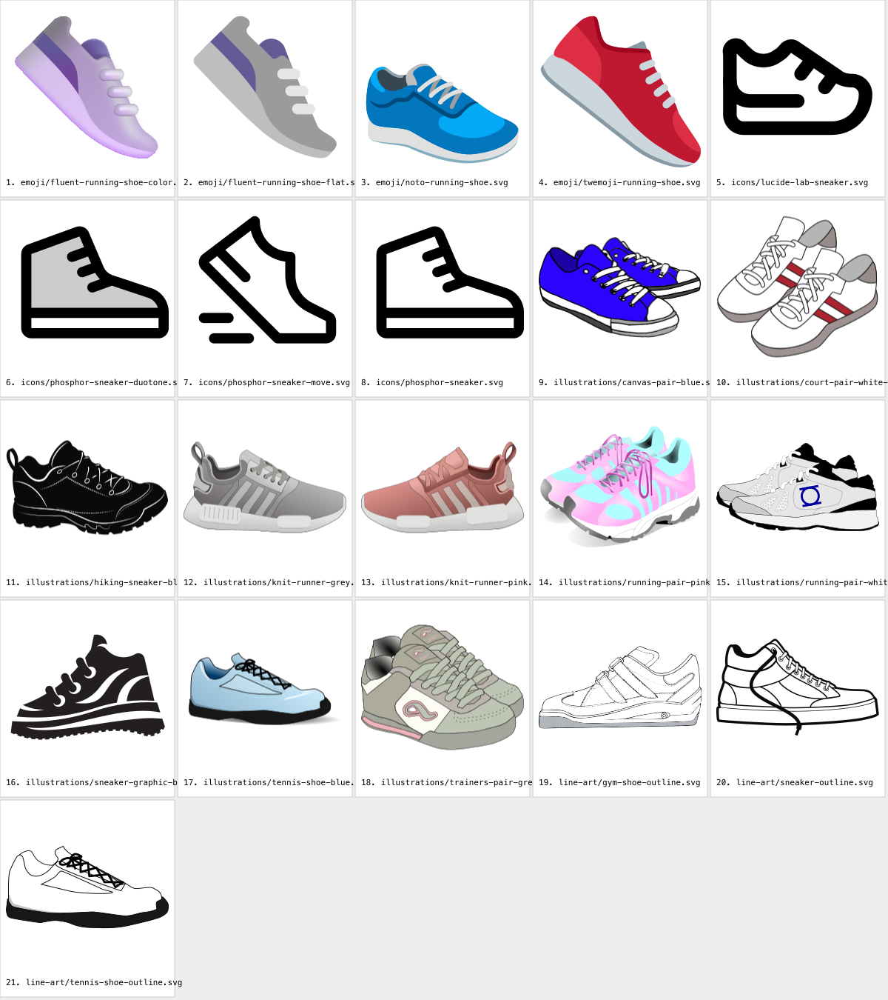

# Sneaker SVG references

21 freely licensed sneaker SVGs found online (2026-10-08), kept here to study, remix and modify
for the StrideMon Sneaker art. Our own drawing is in [`../sneaker/`](../sneaker/README.md).
These files are **references**, not the NFT art itself.

The files are **unchanged from their source**, so their origin stays clear. To modify one, copy it
first (for example into `../sneaker/`), then edit the copy.

## What's here

**Licences, short version:** CC0 means public domain: modify and use commercially, no credit
needed. MIT, ISC, Apache 2.0 and CC BY 4.0 allow the same, but you must keep the copyright and
licence notice (in `licenses/`) with anything you ship that is built from the file.

| # | File | What it is | Size | Source | Author | Licence |
|---|---|---|---|---|---|---|
| 1 | `emoji/fluent-running-shoe-color.svg` | 👟 soft 3D-look running shoe, the most polished of the set | 21 KB | [Fluent Emoji](https://github.com/microsoft/fluentui-emoji/tree/main/assets/Running%20shoe) | Microsoft | MIT |
| 2 | `emoji/fluent-running-shoe-flat.svg` | the same shoe, flat colours | 2 KB | [Fluent Emoji](https://github.com/microsoft/fluentui-emoji/tree/main/assets/Running%20shoe) | Microsoft | MIT |
| 3 | `emoji/noto-running-shoe.svg` | 👟 blue runner with a white sole | 6 KB | [Noto Emoji](https://fonts.gstatic.com/s/e/notoemoji/latest/1f45f/emoji.svg) ([repo](https://github.com/googlefonts/noto-emoji)) | Google | Apache 2.0 (images; the fonts are OFL) |
| 4 | `emoji/twemoji-running-shoe.svg` | 👟 red runner, flat | 3 KB | [Twemoji](https://github.com/jdecked/twemoji/blob/main/assets/svg/1f45f.svg) | Twitter, Inc. and contributors | CC BY 4.0 |
| 5 | `icons/lucide-lab-sneaker.svg` | line icon | <1 KB | [Lucide Lab](https://github.com/lucide-icons/lucide-lab) | Lucide contributors | ISC |
| 6 | `icons/phosphor-sneaker-duotone.svg` | high-top icon, two tones | 1 KB | [Phosphor](https://github.com/phosphor-icons/core) | Phosphor Icons | MIT |
| 7 | `icons/phosphor-sneaker-move.svg` | sneaker in motion icon | 1 KB | [Phosphor](https://github.com/phosphor-icons/core) | Phosphor Icons | MIT |
| 8 | `icons/phosphor-sneaker.svg` | high-top icon | 1 KB | [Phosphor](https://github.com/phosphor-icons/core) | Phosphor Icons | MIT |
| 9 | `illustrations/canvas-pair-blue.svg` | pair of blue canvas sneakers, detailed laces | 256 KB | [Openclipart 319669](https://openclipart.org/detail/319669) | liftarn | CC0 |
| 10 | `illustrations/court-pair-white-red.svg` | pair of white court shoes with red stripes | 31 KB | [Openclipart 313162](https://openclipart.org/detail/313162) | oksmith | CC0 |
| 11 | `illustrations/hiking-sneaker-black.svg` | black trail sneaker with white detail lines | 76 KB | [Openclipart 300863](https://openclipart.org/detail/300863) | oksmith | CC0 |
| 12 | `illustrations/knit-runner-grey.svg` | grey knit runner with shading, the most realistic | 36 KB | [FreeSVG](https://freesvg.org/re-shoe-clipart-2017070837-remix) | Openclipart user | CC0 |
| 13 | `illustrations/knit-runner-pink.svg` | the same shoe in pink | 27 KB | [FreeSVG](https://freesvg.org/shoe-clipart-2017070724-remix) | Openclipart user | CC0 |
| 14 | `illustrations/running-pair-pink-cyan.svg` | pair of bright running shoes with shading | 38 KB | [FreeSVG](https://freesvg.org/vector-drawing-of-sneakers) | Openclipart user | CC0 |
| 15 | `illustrations/running-pair-white-blue.svg` | pair of white/black running shoes with a blue logo | 63 KB | [FreeSVG](https://freesvg.org/1532103586) | Openclipart user | CC0 |
| 16 | `illustrations/sneaker-graphic-black.svg` | bold stylised black-and-white sneaker | 42 KB | [FreeSVG](https://freesvg.org/sneaker-silhouette) | FreeSVG | CC0 |
| 17 | `illustrations/tennis-shoe-blue.svg` | light blue tennis shoe, crossed laces | 10 KB | [FreeSVG](https://freesvg.org/blue-tennis-shoe-vector-image) | Openclipart user | CC0 |
| 18 | `illustrations/trainers-pair-grey-pink.svg` | pair of grey/pink trainers | 41 KB | [FreeSVG](https://freesvg.org/shoes-vector-image) | Openclipart user | CC0 |
| 19 | `line-art/gym-shoe-outline.svg` | gym shoe, outline only | 132 KB | [FreeSVG](https://freesvg.org/gym-shoe-vector-drawing) | Openclipart user | CC0 |
| 20 | `line-art/sneaker-outline.svg` | clean sneaker outline with loose laces | 22 KB | [Openclipart 308649](https://openclipart.org/detail/308649) | oksmith | CC0 |
| 21 | `line-art/tennis-shoe-outline.svg` | tennis shoe, outline and black sole | 8 KB | [Openclipart 262588](https://openclipart.org/detail/262588) | lauksas | CC0 |

FreeSVG labels its files "Creative Commons 0 (public domain)", and most are mirrored from
Openclipart, where every upload is public domain. The individual Openclipart artist isn't shown on
FreeSVG pages.

## Which to start from

- **The richest drawings:** #12 and #13 (knit runner, shaded), #14 (running pair), #1 (Fluent,
  3D look), #9 (canvas pair).
- **The easiest to recolour and restyle:** the line art (#19 to #21) and the flat ones (#2, #3,
  #4, #17). They have few paths with plain fills.
- **For icons in the app or site:** #5 to #8.

## Before using one in the NFT

- **Brand marks.** #12 and #13 have three side stripes in the style of a famous brand's knit
  runner. Remove or redesign the stripes before shipping anything built from them. I left out
  files with a brand's logo or name outright (a Converse star patch, an Adidas "SAMBA").
- **Gradients.** #1, #12, #13, #14, #17 and #18 use gradients (#1 has about 50), which D-030
  rules out for the on-chain art (`react-native-svg` parity). Flatten them to solid tonal fills
  when adapting one.
- **Size.** On-chain art should stay small. #9 (256 KB) and #19 (132 KB) are Inkscape files with
  heavy paths. Simplify them (for example with `svgo`) before porting.
- **Attribution.** For #1 to #8, keep the matching notice from `licenses/`. For #4 (CC BY 4.0),
  also credit "Twemoji by Twitter, Inc. and contributors" where the art is shown.

## Where else to look

Searched, but nothing kept:
- **SVG Repo** has CC0 sneakers, but it blocks direct downloads. Download by hand from the site and
  check each file's licence on its page.
- **Wikimedia Commons** had no good sneaker SVGs.
- **OpenMoji** (CC BY-SA 4.0) is low detail, and its share-alike licence would bind derivatives.
- **Freepik and Vecteezy** need attribution or a paid licence and forbid redistributing their
  files, so they can't sit in this repo.
