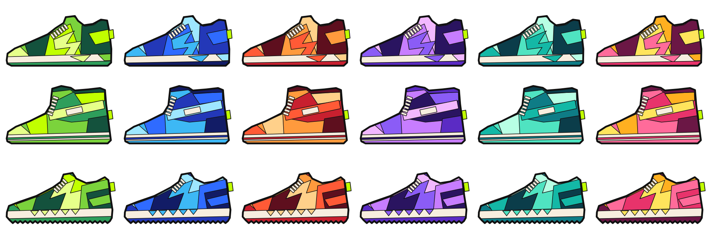

# Sneaker templates (flat-panel draft)

A draft art system in the style of STEPN's everyday sneakers (2026-10-08): angular panels, solid
fills, a thick black outline, a cream midsole, cream lace slats and a lime heel tag. It's the
generative alternative to the single detailed Sneaker in [`../sneaker/`](../sneaker/README.md).



**A Sneaker = a template + a colour family + a seed.**
- The **template** gives the silhouette and the named panels.
- The **family** gives five shades, light to dark.
- The **seed** shuffles which shade each panel gets: the three light shades among the light
  roles, the two dark shades among the dark roles. The collar and sole stay dark, so every
  colourway still reads as a shoe.

Rebuild from the repo root (the PNGs need `rsvg-convert`: `brew install librsvg`):

```bash
bun packages/contracts/art/sneaker-templates/build-sneaker-templates.ts
```

| File | What it is |
|---|---|
| `build-sneaker-templates.ts` | The templates, families and renderer. The source of truth: edit this, never the SVGs |
| `runner.svg`, `high-top.svg`, `trail.svg` | Each template in the ocean family, 2 to 3 KB each |
| `variants/<template>-<family>.svg` | All 18 combinations |
| `preview-grid.svg` / `.png` | The grid above |

## The templates

Each is a silhouette polygon plus panels drawn back to front and clipped to it. Panels may
overshoot the silhouette, so drawing them is quick.

| Template | Silhouette | Panels |
|---|---|---|
| `runner` | low runner | toe cap, vamp, quarter with an "S"-shaped shard, heel counter and shard, collar, midsole with two shards, outsole, 6 lace slats |
| `high-top` | tall basketball-style | toe cap, vamp, ankle panel and shard, a strap across the ankle with a cream pad, heel counter, collar, midsole with a stripe, outsole, 6 lace slats |
| `trail` | low trail shoe with a lugged outsole | toe bumper, zigzag shards across the side, heel counter with a cage, collar, a row of saw-tooth triangles on the midsole, outsole, 5 lace slats |

Panel roles: `light`, `base`, `mid` (the shuffled light shades), `deep`, `dark` (the shuffled
dark shades), and `cream` (fixed). The outline (`#111111`, 16 px outside and 5 px between
panels), the cream (`#F7EEDF`) and the lime tag (`#C1FF00`) are the same on every Sneaker. That
shared frame is what makes them read as one collection.

**Colour families:** volt, ocean, ember, grape, mint, sunset.

## Why this style fits on-chain

- Only polygons, solid fills and one clip path: no gradients, filters or patterns (D-030).
- About 2 to 3 KB per Sneaker, and the templates are a few hundred numbers. A Solidity renderer
  could hold dozens of templates.
- Variety multiplies:
  - **colour:** templates × families × seeds
  - **shape:** more templates, or per-panel options (shard shapes, strap or no strap, sole style)

  That's the route to 1,000 visibly different Founding Passes from a small amount of art.

## Open points

- **The lime tag vanishes on the volt family** (lime on lime). Either give volt a different tag
  colour, or outline the tag in cream.
- **Only three templates**, drawn quickly. STEPN has about 80 base designs. Ten or so good ones
  plus per-panel options would be plenty for 1,000.
- **No trademark lookalikes:** keep the slanted-stripe and swoosh-like shapes out (Trail's sole uses
  triangles for this reason).
- **Not yet checked in the app** (`SvgXml` on the Android phone). It uses one `<clipPath>`, which
  D-030 didn't list.
