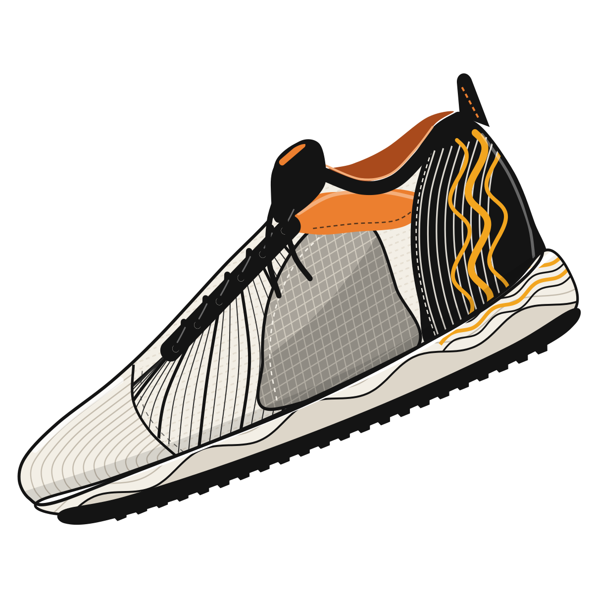

# Sneaker art (design reference)

The approved look for the NFT Sneaker (Yash, 2026-10-08): one detailed running shoe, drawn as
an SVG. It comes bare (transparent, for any card or app screen) and on four quiet backgrounds to
choose from.



| File | What it is |
|---|---|
| `build-sneaker-art.ts` | The generator. The source of truth for the drawing: edit this, never the SVGs |
| `sneaker.svg` | The bare shoe: a square `viewBox` cropped tight around it, transparent background (about 44 KB) |
| `sneaker-<background>.svg` | The shoe on each background below, in a roomier square frame (about 46 KB each) |
| `*.png` | 1200 px previews of each SVG, for looking at them quickly |

Rebuild everything from the repo root (the PNGs need `rsvg-convert`: `brew install librsvg`):

```bash
bun packages/contracts/art/sneaker/build-sneaker-art.ts
```

## How it's drawn

The shoe is drawn side-on in its own coordinates (toe left, heel right, ground ≈ y 340), then
posed: rotated −22° (toe down, heel up) and scaled 1.26 × 1.38. Back to front:

| Part | How |
|---|---|
| Upper | cream base + a knit `<pattern>`, and 26 forefoot "cage" lines that sweep from the sole into the lace stay (every 4th bold) |
| Mesh window | grey panel with a grid and a shadow band, clipped to its outline |
| Toe cap | an overlay with 13 contour lines (the toe's edge, shrunk step by step) and a stitched seam |
| Suede | an orange panel with a peach highlight and stitching, between the lace stay and the heel |
| Heel | a black counter with 9 cream flow lines parallel to its front edge, three amber waves and a shaded back |
| Collar and tongue | the far side's lining, a padded collar, the pull tab, a black tongue with an orange tag |
| Laces | a black lace stay with 6 eyelets, crossing laces with a highlight, and two loose ends |
| Midsole | cream foam with a wavy recess, a ridge line, an amber insert at the heel and a top highlight |
| Outsole | a black outsole with lugs along its bottom edge |
| Volume | a dark band low on the upper, a highlight on the toe, and a crisp outer outline |

## Backgrounds

Each is a function in `backgrounds` in the generator. They use the same rules as the shoe: flat
fills, and stacked translucent shapes in place of gradients and blur.

| Name | What it is |
|---|---|
| `studio` | A warm wall (`#E9E2D7`), a soft pool of light behind the shoe, and a soft cast shadow down and to the right |
| `contour` | The warm wall with thin contour rings (echoing the toe cap) and the app card's `+` corner marks |
| `night` | The app's dark panel (`#141515`) with a faint lime glow and corner marks |
| `volt` | Solid StrideMon lime (`#C1FF00`) with a deep green cast shadow |

The cast shadow is 36 faint copies of the shoe's silhouette (`<use href="#silhouette">`), each a
little further out. The light pool is 18 stacked circles at low opacity. Which background the NFT
uses is still Yash's pick.

Lines that repeat (cage, contours, flow lines, waves, grid, lugs) are computed in loops, so a
Solidity port can draw them with loops too instead of storing every path.

## Constraints and open points

- **No filters, no gradients, no CSS** (D-030), so `react-native-svg` should draw it the same as a
  browser. Shading is flat tonal panels and translucent strokes.
- **It does use `<clipPath>`, one `<pattern>` and, with a background, `<use>`**, which D-030's "plain paths, rects and text" did
  not list. `react-native-svg` supports all three, but nobody has checked this drawing in the app yet.
  Check it on the Android phone (`SvgXml`) before the Solidity port relies on them.
- **Colours are one fixed colourway** (cream, black, orange, amber, in `colors`). Varying the
  colourway, panel patterns and details per token is the next design step (see
  `docs/founding-pass-brief.md` §4.3).
- **On-chain**: the brief (Part 1) ports this drawing into a Solidity renderer, and that renderer
  becomes the only implementation of the art. Until then, this script is the reference the port
  must match.
